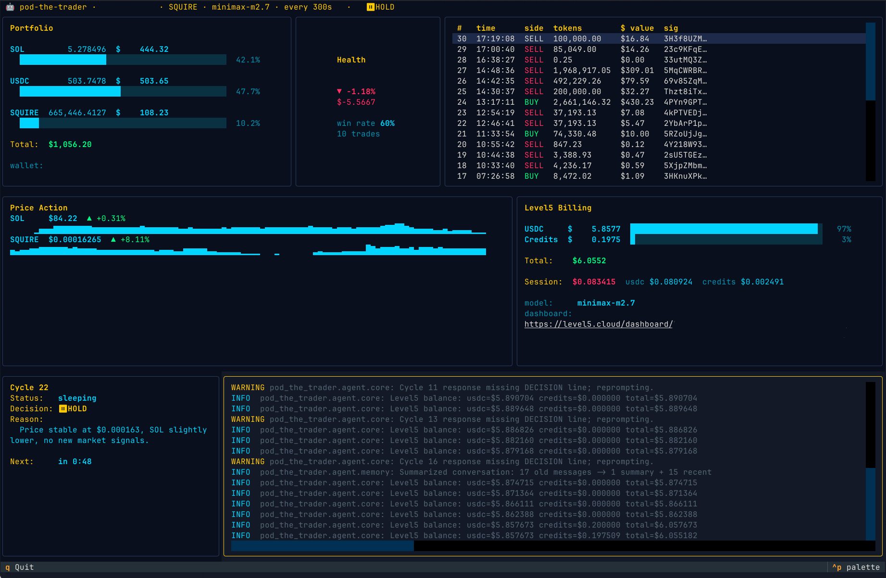

# Pod The Trader

An autonomous Solana trading agent. An LLM makes live buy/sell decisions on a single target token from a real mainnet wallet, and a btop-style Textual dashboard shows you what it's doing.



## What it does

- **Runs a cycle every N seconds.** Each cycle fetches on-chain balances, recent price history, and trade history, hands them to an LLM, and records the model's decision (BUY, SELL, or HOLD) along with the reason.
- **Executes real swaps** through Jupiter DEX aggregator. SOL, USDC, and one configured target token are the only mints it can touch — a tool-layer guard rejects anything else.
- **Tracks cost basis** in a lot-based ledger. Every position change (bot trade, external deposit, external withdrawal, gas) is a cost-basis event; realized and unrealized P&L come from FIFO lot matching instead of volume math. A reconciler runs before every cycle and at startup to absorb any on-chain drift the bot didn't cause.
- **Shows it all live** in a 3×3 Textual grid: Portfolio, Health (P&L gauge), Trade ledger, Market Charts (SOL/target price plus RSI / IPP / rolling-volatility sparklines for the target token), Level5 Billing (inference cost), Cycle status, and a scrollable log tail.
- **Bills its own inference** through your choice of [Level5](https://level5.cloud) or [UsePod](https://usepod.ai) — Solana-native pay-as-you-go LLM proxies. Run account-based (fund a USDC balance once, draw per request) or fully accountless via UsePod's [x402](https://www.x402.org) endpoint (no account/token — the bot pays each call straight from the local wallet, bounded by config spend caps). Pick with `--provider {level5,usepod,usepod-x402}` at startup (or the `provider` config key); the bot remembers your choice in the saved credentials file.

## Quick install

**Linux / macOS:**

```bash
curl -LsSf https://raw.githubusercontent.com/Sortis-AI/pod_trades/main/install.sh | bash
```

Installs git, [`uv`](https://docs.astral.sh/uv/), and Python 3.12 (via snap → apt on Linux or brew on macOS), clones the repo to `~/pod-the-trader`, runs `uv sync`, and drops a launcher at `~/.local/bin/pod-the-trader`.

**Windows 10 / 11** (run in PowerShell inside Windows Terminal — not legacy `cmd.exe`):

```powershell
irm https://raw.githubusercontent.com/Sortis-AI/pod_trades/main/install.ps1 | iex
```

Installs git (via winget), `uv`, and Python 3.12, clones the repo to `%USERPROFILE%\pod-the-trader`, runs `uv sync`, and drops a launcher at `%USERPROFILE%\.local\bin\pod-the-trader.cmd`.

Then open a new shell and run:

```bash
pod-the-trader
```

On first launch you'll see a disclaimer. Type `I ACCEPT` to continue, then walk through the Level5 registration and wallet-generation prompts. If you let the wizard generate a new wallet, it will print the private key exactly once and require you to type `I SAVED IT` to confirm you've backed it up — **this is your only chance to capture it**, so copy it into a password manager or write it down before continuing.

To upgrade later, run `pod-the-trader update` — it pulls the latest code and re-runs `uv sync`.

> **Heads-up:** the bot moves real funds on Solana mainnet. Start by funding the wallet with a small amount you're comfortable losing entirely, watch it run for a few cycles, and read the disclaimer carefully — it's shown at every launch for a reason.

## Requirements

- **OS:** Linux, macOS, or Windows 10/11. On Windows, use PowerShell inside Windows Terminal — legacy `cmd.exe` cannot render the Textual dashboard.
- **Python:** 3.12+
- **Wallet:** a Solana keypair. The installer can generate one for you on first run; the private key lives at `~/.pod_the_trader/keypair.json` (`%USERPROFILE%\.pod_the_trader\keypair.json` on Windows) and is never transmitted.
- **Provider account (Level5 or UsePod):** the installer walks you through creating one. Pick whichever provider you prefer (`--provider level5` or `--provider usepod`) and fund it with USDC. Level5 also issues promotional credits in some campaigns; UsePod is USDC-only. The bot refuses to trade when the balance falls below a configured floor.
- **Some SOL** in your trading wallet to cover Jupiter gas.

## Choosing a provider

There are three providers. **Level5** and **UsePod** are account-based: register once, fund the account with USDC, and the bot draws from that server-side balance per request. **UsePod x402** is *accountless*: there's no registration, no API token, and no dashboard — the bot pays for each inference call directly from your local Solana wallet over the [x402 protocol](https://www.x402.org).

Level5 and UsePod expose a byte-identical API surface (UsePod is a Rust port of Level5), so the only operator-facing differences are:

- **Default model name.** Level5 has its own catalog (e.g. `minimax-m2.7`); UsePod proxies OpenAI/Anthropic-shaped names (e.g. `claude-sonnet-4-6`, `gpt-5.3-codex`). Update `agent.model` in your config when you switch.
- **Credits.** Level5 supports promotional credits separate from USDC; UsePod is USDC-only. The dashboard hides the Credits row automatically when UsePod is active.
- **Dashboard URL.** Level5 uses `https://level5.cloud/dashboard/<token>`; UsePod uses `https://usepod.ai/dashboard?token=<token>`.

**UsePod x402 (accountless, `usepod-x402`).** No account or token — the wallet is the identity. Each request hits `https://api.usepod.ai/proxy/x402/v1`, receives an HTTP `402` payment challenge, and the bot pays the quoted USDC on-chain from the trading wallet, then retries. Because real funds move automatically on every call, two **config-editable safety caps** bound the spend (see the `usepod-x402` config section):

- `per_request_cap_usdc` (default `0.50`) — reject any single 402 quote above this; the cycle aborts rather than overpay a malformed/hostile quote.
- `max_daily_x402_spend_usdc` (default `10.0`) — once cumulative x402 spend in a UTC day reaches this, inference pauses until the next day.

Inference spend competes with trading capital in the same wallet (`min_balance_threshold_usdc` gates it). There's no dashboard — spend is visible on-chain.

UsePod's x402 runs in `cap-with-surplus-credit` mode: a payment charges your actual usage and credits the unused remainder (cap − actual) to a balance keyed to your wallet, applied to later calls — so **one payment typically funds many requests** and the bot pays only when a fresh `402` arrives. Because the quoted `amount_microunits` is a *cap pre-authorization* (the full amount leaves the wallet on-chain; the surplus is recoverable only as future inference credit, not a refund), set `per_request_cap_usdc` **at or above the gateway's cap quote** — if x402 calls keep aborting on the per-request cap, raise it.

You can pick a provider three ways, listed in increasing precedence:

1. **Config file** — set `provider: "usepod-x402"` at the top of your YAML.
2. **CLI flag** — `pod-the-trader --provider usepod-x402` (overrides config). Valid values: `level5`, `usepod`, `usepod-x402`.
3. **Env-skipped onboarding** — set `LEVEL5_API_TOKEN` *or* `USEPOD_API_TOKEN`. The wizard reads only the active provider's variable; cross-pairs are ignored. (x402 needs no token — only a funded wallet.)

The first time you launch, the wizard asks you to pick a provider. Account-based providers then offer register / paste-token / skip; the accountless x402 option just confirms the wallet will pay. The choice is saved in `~/.pod_the_trader/level5_credentials.json` (filename kept for backward compatibility) along with the provider key, so subsequent launches don't re-prompt.

## Configuration

Defaults live in `pod_the_trader/config/defaults.yaml`. Override any of them with a user YAML file passed via `--config`:

```bash
pod-the-trader --config ~/my-trader.yaml
```

The knobs you'll care about most:

| Key | Default | What it does |
|---|---|---|
| `trading.target_token_address` | `EN2nn…SQUIRE` | The token the bot is trying to trade profitably. Can also be set via `TARGET_TOKEN_ADDRESS` env var. |
| `trading.max_position_size_usdc` | `100` | Hard cap on position size, in USDC. |
| `trading.max_slippage_bps` | `150` | Max Jupiter slippage tolerance, in basis points. |
| `trading.min_trade_size_usdc` | `1.0` | Swaps below this USD value are rejected at the tool layer. Network fees would exceed the trade value. |
| `trading.max_daily_trades` | `20` | Per-day safety cap. |
| `trading.cooldown_seconds` | `300` | Seconds to wait between cycles. |
| `trading.max_price_impact_pct` | `1.5` | Refuse swaps with worse Jupiter-reported price impact. |
| `trading.fallback_slice_usdc` | `25.0` | Slice size used when Jupiter doesn't report `liquidity_usd` on the latest tick. Prevents the `min($150, 0.015 * liquidity_usd)` sizing rule from collapsing to `$0` and silently blocking trades. |
| `provider` | `level5` | Active LLM-proxy provider. One of `level5`, `usepod`, or `usepod-x402` (accountless, wallet-paid). Override at startup with `--provider`. |
| `level5.min_balance_threshold_usdc` | `0.1` | Pause trading when Level5 balance drops below this floor. |
| `level5.base_domain` | `level5.cloud` | Host for the Level5 API (`api.<domain>`) and dashboard (`<domain>/dashboard/<token>`). Override on the command line with `--base-domain`. |
| `usepod.min_balance_threshold_usdc` | `0.1` | Pause trading when UsePod balance drops below this floor. |
| `usepod.base_domain` | `usepod.ai` | Host for the UsePod API and dashboard (UsePod uses `<domain>/dashboard?token=<token>`). |
| `usepod-x402.x402_asset` | `USDC` | Asset used to settle accountless x402 inference charges. |
| `usepod-x402.per_request_cap_usdc` | `0.50` | Reject (and abort the cycle on) any single x402 quote above this — bounds a bad/hostile quote. |
| `usepod-x402.max_daily_x402_spend_usdc` | `10.0` | Pause x402 inference once cumulative USDC spend in a UTC day reaches this. |
| `usepod-x402.min_balance_threshold_usdc` | `1.0` | Pause trading/inference when the wallet's USDC (the x402 budget) drops below this floor. |
| `agent.model` | `minimax-m3` | The LLM the active provider proxies to. UsePod expects OpenAI/Anthropic-shaped names like `claude-sonnet-4-6` or `gpt-5.3-codex`; Level5 has its own model catalog. Change this when you switch providers. |
| `agent.max_iterations_per_turn` | `10` | Max tool-call iterations per cycle. |

## Usage

```bash
# Full dashboard (default if stdout is a real terminal)
pod-the-trader

# Plain CLI mode (default if stdout is piped)
pod-the-trader --cli

# Force TUI even when output is piped
pod-the-trader --tui

# Custom config
pod-the-trader --config path/to/config.yaml

# Choose an LLM-proxy provider (default: level5)
pod-the-trader --provider usepod

# Point at an alternate deployment host (host-only override; useful for
# self-hosted Level5-compatible deployments).
pod-the-trader --base-domain alt.example.com

# Pull the latest code and re-sync dependencies
pod-the-trader update
```

Keybindings inside the TUI:

| Key | Action |
|---|---|
| `q` | Quit (graceful shutdown — finishes current cycle) |
| `Ctrl+C` | Same as `q` |
| Click wallet address in Portfolio panel | Copy wallet to clipboard |
| Click dashboard URL in Level5 panel | Open Level5 dashboard in default browser |

On exit the bot prints a summary of the current session: closed trades, realized P&L, unrealized P&L, open position, gas spent.

## How it works

```
┌─ Trading agent (async) ───────────────────────────────────────┐
│                                                               │
│   Level5 balance  ──┐                                         │
│   Price sample    ──┼──▶ Reconcile on-chain ──▶ Run LLM turn  │
│   Wallet snapshot ──┘                              │          │
│                                                    │          │
│                            Tool registry ◀─────────┤          │
│                              │                     │          │
│       ┌──────────────────────┼─────────────────────┐          │
│       │            │         │          │         │          │
│     Market      Portfolio  History  Trading    Solana         │
│     tools       tools      tools    tools      tools          │
│                                       │                       │
│                           Jupiter DEX aggregator              │
│                                       │                       │
└───────────────────────────────────────┼───────────────────────┘
                                        │
                              Solana mainnet
```

- **Agent** (`pod_the_trader/agent/core.py`) runs the cycle loop, builds the system prompt, enforces that BUY/SELL decisions are backed by an actual `execute_swap` call, and publishes events to a TUI publisher. The prompt encodes a mean-reversion strategy keyed on the **Inference Payback Period (IPP)** — `500_000 × target_price_usd` ≈ days for $1/day of inference yield to repay the market price of 500,000 target tokens — with bands at IPP 180 / 365 / 500 mapping to BUY / NEUTRAL / HOLD-ONLY / TRIM regimes.
- **Tools** (`pod_the_trader/tools/`) are the only way the model touches the world. Every swap entry point is gated by a route guard (SOL/USDC/target only) and a minimum-trade-size guard ($1 default).
- **Lot ledger** (`pod_the_trader/data/lot_ledger.py`) is an event-sourced cost-basis ledger. FIFO matching produces closed segments with entry and exit prices; realized P&L falls out of those directly.
- **Reconciler** (`pod_the_trader/data/reconciler.py`) compares ledger open-lot sum against the actual on-chain balance every cycle and at startup, and emits synthetic events to absorb any drift.
- **TUI** (`pod_the_trader/tui/`) is a Textual app that implements the Publisher protocol; the agent sends events, widgets update reactively.
- **Level5 client** (`pod_the_trader/level5/`) handles account registration, balance queries, and auto-deposit from the trading wallet when inference credits run low.

## Safety

This software moves real funds on mainnet. Read [`pod_the_trader/disclaimer.py`](pod_the_trader/disclaimer.py) for the full list of things that can go wrong. Short version:

- The LLM can hallucinate, misread data, and pick bad trade sizes. It has done all of these during development.
- There is no testnet mode, no dry run, and no undo for on-chain transactions.
- Your private key lives at `~/.pod_the_trader/keypair.json` (or `%USERPROFILE%\.pod_the_trader\keypair.json` on Windows). Anyone with access to that file can drain your wallet. The bot restricts it to the owning user only — `chmod 0o600` on POSIX, `icacls /inheritance:r /grant:r <user>:F` on Windows — but filesystem permissions are the last line of defense, not the first.
- Memecoin trading is high-risk; most positions lose money. **Do not put more into the trading wallet than you can afford to lose entirely.**

The bot enforces several hard guards to reduce foot-gun potential:

- **Tradeable universe**: only SOL, USDC, and the configured target token. Anything else is rejected by the tool layer.
- **Minimum trade size**: swaps under `min_trade_size_usdc` (default $1) are rejected so dust trades don't bleed fees.
- **Decision-execution enforcement**: if the model writes `DECISION: SELL` but never calls `execute_swap`, the trade loop catches it, nudges the model to either execute or downgrade, and falls back to `HOLD` if it still doesn't comply — so the dashboard can never show a sell that didn't happen.
- **Disclaimer on every startup**: no bypass, no env var shortcut. You type `I ACCEPT` every time.

## Development

```bash
# Install dev dependencies
uv sync --extra dev

# Run the full suite
uv run pytest tests/

# Lint
uv run ruff check pod_the_trader/ tests/
uv run ruff format pod_the_trader/ tests/

# End-to-end smoke test (clears conversation state, runs for 60s, checks the log)
bash scripts/check.sh 60
```

The test suite is mostly unit tests against real component boundaries with mocked external services (Level5, Jupiter, Solana RPC). The TUI widgets are tested through `Textual App.run_test()` so reactive behavior runs for real.

## Releasing

Releases are tagged `vX.Y.Z` and published on GitHub. Operator machines pull them in via `pod-the-trader update`, which does `git fetch && git reset --hard origin/<branch> && uv sync` — no version pin to bump, no installer change required. The installers (`install.sh`, `install.ps1`) clone HEAD, so new installs also pick up the latest release automatically.

End-to-end release procedure:

```bash
# 1. Bump the version. Bundling the bump in the same commit as the
#    user-visible change is the established pattern — see e63dd52
#    (0.2.0) and 21d2bad (0.2.1).
sed -i 's/^version = ".*"/version = "X.Y.Z"/' pyproject.toml

# 2. Regenerate uv.lock (this happens implicitly on the next `uv run`,
#    but doing it explicitly keeps the lock change in the same commit
#    as the version bump). Pass `--extra dev` so lint/test tools stay
#    installed — a bare `uv sync` will uninstall them.
uv sync --extra dev

# 3. Lint + tests must pass before tagging.
uv run ruff check pod_the_trader/ tests/
uv run ruff format pod_the_trader/ tests/
uv run pytest -q

# 4. Commit. Stage specific files only — never `git add -A`.
git add pyproject.toml uv.lock <other-changed-files>
git commit -m "<one-line summary>"

# 5. Annotated tag with a short body listing the commits included.
git tag -a vX.Y.Z -m "X.Y.Z: <one-line summary>

<short-sha-1> <subject>
<short-sha-2> <subject>"

# 6. Push the branch first, then the tag — never the tag alone, or
#    GitHub will create a release whose commits are not yet on main.
git push origin main
git push origin vX.Y.Z

# 7. Publish the GitHub release. Notes follow the v0.2.0/v0.2.1
#    template: short summary, one section per change with the "why",
#    config additions table, operator-visible gaps that remain.
gh release create vX.Y.Z \
  --title "vX.Y.Z — <short title>" \
  --notes "$(cat <<'EOF'
<markdown release notes>
EOF
)"
```

Conventions:

- **Never** force-push `main` or rewrite published tags.
- **Never** skip pre-commit hooks (`--no-verify`) or bypass signing on a release commit.
- A release that changes the strategy prompt should call out behavior changes the operator will see on the next cycle — strategies in this repo are live on mainnet wallets, not lab experiments.
- If a release introduces a config field, add it to the [Configuration](#configuration) table in the same pass.

## Repository layout

```
pod_the_trader/
├── agent/          # LLM trading loop + conversation memory
├── config/         # defaults.yaml + validated loader
├── data/           # trade ledger, lot ledger, price log, wallet log, reconciler
├── level5/         # Level5 account, balance, auto-funding
├── tools/          # LLM-callable tools (swap, portfolio, market, history)
├── trading/        # Jupiter DEX, Portfolio, transaction builder
├── tui/            # Textual dashboard + widgets
├── wallet/         # Keypair management + setup prompts
├── disclaimer.py   # Startup disclaimer (I ACCEPT gate)
└── main.py         # Entry point (CLI + TUI paths)

tests/              # Unit + integration + e2e tests
scripts/            # check.sh, e2e_test.sh, debug helpers
docs/               # Screenshots + user-facing docs
install.sh          # One-shot installer (curl | bash)
```

## License

Pod The Trader is free software released under the **GNU General Public License v3.0 or later**. See [`LICENSE`](LICENSE) for the full text.

    Pod The Trader is free software: you can redistribute it and/or modify
    it under the terms of the GNU General Public License as published by
    the Free Software Foundation, either version 3 of the License, or
    (at your option) any later version.

    This program is distributed in the hope that it will be useful,
    but WITHOUT ANY WARRANTY; without even the implied warranty of
    MERCHANTABILITY or FITNESS FOR A PARTICULAR PURPOSE. See the
    GNU General Public License for more details.

## Disclaimer

This is the full disclaimer shown at every launch. You must type `I ACCEPT` before the bot will start. It is reproduced here verbatim from [`pod_the_trader/disclaimer.py`](pod_the_trader/disclaimer.py) so you can read it before you install.

> **POD THE TRADER — DISCLAIMER**
>
> This is autonomous trading software that will buy and sell real tokens on the Solana mainnet using your wallet and your money. Before you start it, read this and make sure you understand what you're agreeing to.
>
> 1. **REAL FUNDS.** Every trade moves actual SOL, USDC, and SPL tokens from your wallet. There is no testnet mode, no dry run, no simulation layer. Losses are real and on-chain transactions are irreversible.
>
> 2. **LLM-DRIVEN DECISIONS.** Trading decisions are made by a large language model (minimax-m3 via the configured LLM proxy). The model can hallucinate, misread market data, make arithmetic errors, pick bad sizes, or act on stale context. It has already done all of these during development. Do not assume it will make profitable trades.
>
> 3. **NO WARRANTY.** This software is experimental and provided as-is, with no guarantee of correctness, profitability, uptime, or data integrity. Recent history includes pricing bugs, unintended trade routes, dust trades, and decision-execution mismatches. More bugs almost certainly remain.
>
> 4. **YOU ARE THE OPERATOR.** You are responsible for monitoring the bot, setting sensible position limits, funding the wallet appropriately, and shutting it down if something looks wrong. The bot will not stop itself just because it's losing money.
>
> 5. **NOT FINANCIAL ADVICE.** Nothing this software outputs — on-screen, in logs, or in summaries — constitutes financial, legal, tax, or investment advice. Memecoin trading is high-risk and most positions lose money.
>
> 6. **KEY CUSTODY.** Your private key lives in `~/.pod_the_trader/`. Anyone with access to that file can drain your wallet. You are solely responsible for the security of that file and the machine it sits on.
>
> 7. **NO RECOURSE.** If the bot loses your money, executes an unintended trade, fails to execute an intended trade, or misreports P&L, there is no one to appeal to. Do not put more into this wallet than you can afford to lose entirely.
>
> By continuing, you confirm that you have read and understood the above, that you accept full responsibility for any losses, and that you are running this software voluntarily and at your own risk.
